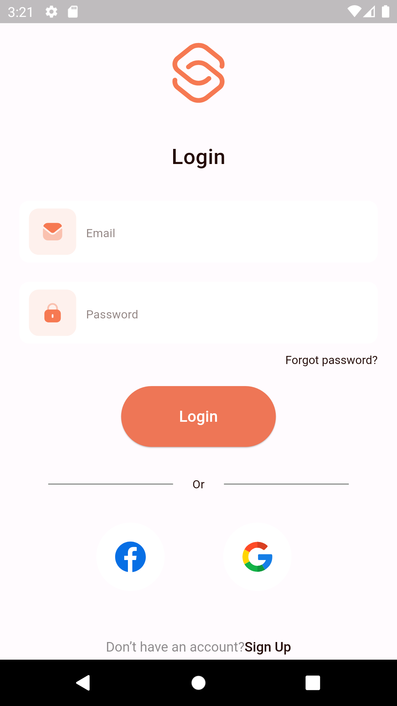

# e_commerce

A new Flutter project.

## Description

This project uses an api to display categories, products and products by categories, this e-commerce app also allows users add products to cart and checkout cart. On account creation, a user sees all products and categories and can view details of each product.

## Screenshot

|                        Splash Screen                        |                        Login Screen                         |
|:-----------------------------------------------------------:|:-----------------------------------------------------------:|
|  |  |

|                        Signup Screen                         |                        Home Screen                         |
|:------------------------------------------------------------:|:----------------------------------------------------------:|
|  |  |

|                       Add to cart Screen                        |                        Checkout Screen                         |
|:---------------------------------------------------------------:|:--------------------------------------------------------------:|
|  |  |

|                        Profile Screen                         |
|:-------------------------------------------------------------:|
|  | 
